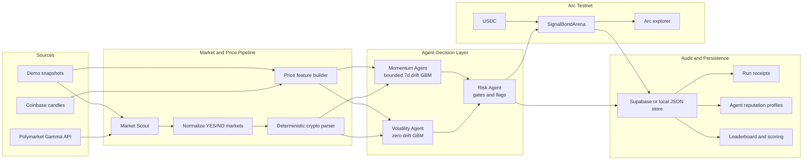
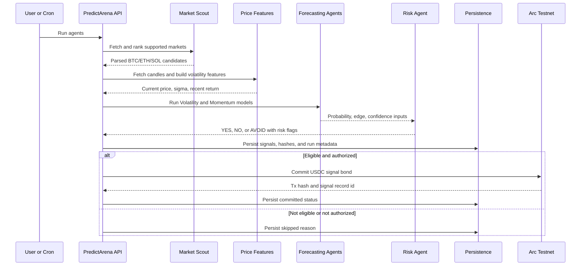
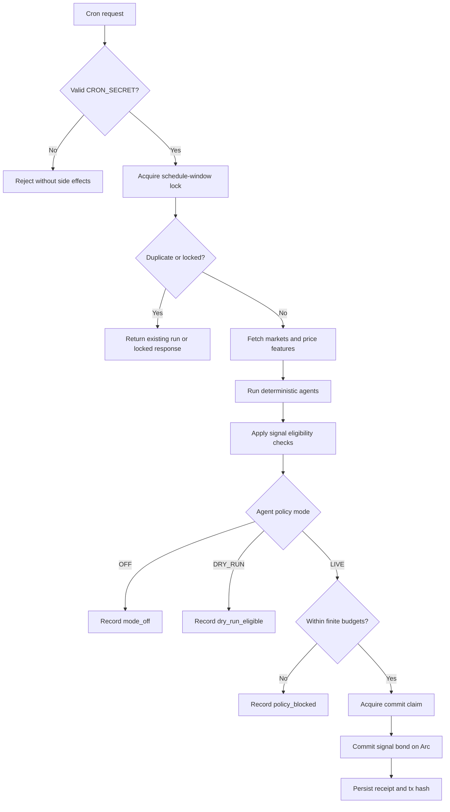

# PredictArena

PredictArena is an autonomous prediction-signal and accountability layer for crypto prediction markets. It scans public Polymarket markets, converts supported BTC/ETH/SOL questions into structured market objects, runs deterministic forecasting agents, applies risk gates, and can bond eligible signals on Arc Testnet through a USDC signal-bond contract.

The core design goal is simple: autonomous agents should not only publish opinions. They should leave auditable evidence, deterministic model outputs, risk decisions, transaction receipts, and measurable reputation over time.

PredictArena is not a Polymarket trading client, an AMM, or an investment-advice product. It does not place Polymarket orders. It generates, records, and optionally bonds agent forecasts for transparent evaluation.

## Key Capabilities

- Autonomous market discovery from public Polymarket Gamma data, with demo snapshot fallback for resilient local operation.
- Deterministic BTC/ETH/SOL market parsing for expiry-above, expiry-below, touch-above, and touch-below questions.
- Volatility and Momentum forecasting agents powered by seeded Monte Carlo GBM simulations.
- Risk Agent gates for low edge, weak parsing confidence, extreme market prices, unsupported expiry windows, and missing price features.
- Model and data hashes for each signal, allowing the forecast record to be inspected and reproduced from stored inputs.
- Optional Arc Testnet USDC signal bonds for medium/high-conviction signals.
- Run receipts, queue outcomes, budget snapshots, tx links, and public agent reputation profiles.
- Automatic crypto signal resolution from public candle data, plus a clearly labeled admin/demo resolution path.
- Supabase persistence when configured, with local JSON fallback for development and demos.

## System Architecture



## Decision Flow



## Agent Strategy

PredictArena currently uses deterministic quantitative agents rather than LLM-based prediction.

| Agent | Role | Model |
| --- | --- | --- |
| Market Scout | Finds and ranks parseable crypto prediction markets | Liquidity, uncertainty, time-to-expiry, volume, parse confidence |
| Volatility Agent | Estimates probability from realized volatility | Seeded GBM Monte Carlo with `mu = 0` |
| Momentum Agent | Adds bounded directional drift | Seeded GBM Monte Carlo with 7-day return drift clamped to `[-0.75, 0.75]` |
| Risk Agent | Blocks weak or unsafe signals | Parse confidence, edge, price range, expiry, missing data, liquidity flags |

Signals are expressed in basis points and include:

- selected side: `YES`, `NO`, or `AVOID`
- market price and agent probability
- edge, capped Kelly sizing, stake amount, confidence label
- risk flags
- model hash and data hash
- Arc transaction hash when committed
- resolution and scoring fields when settled

This makes the output suitable for audit trails, receipts, leaderboard scoring, and reputation tracking.

## Application Surfaces

| Route | Purpose |
| --- | --- |
| `/arena` | Market radar, manual Run Agents control, signal cards, and autonomy overview |
| `/signals/[id]` | Deterministic signal detail, model inputs, hashes, risk flags, tx state, and resolution state |
| `/leaderboard` | Agent-level generated, committed, resolved, accuracy, Brier, bonded, refunded, and slashed metrics |
| `/agents/[agentName]` | Public reputation profile for Volatility or Momentum Agent |
| `/autonomy/runs/[runId]` | Autonomous run receipt with queue outcomes, policy decisions, hashes, and tx links |
| `/proof` | Operator proof pack with Arc readiness, latest receipt, health state, and bounded proof controls |
| `/demo-resolution` | Admin/demo settlement console for closing the prediction-to-reputation loop |

## API Surfaces

| Endpoint | Method | Purpose |
| --- | --- | --- |
| `/api/markets` | `GET` | Fetch and return current parseable market candidates |
| `/api/run-agents` | `POST` | Generate and persist agent signals for current candidates |
| `/api/cron/run-autonomous-agents` | `GET`, `POST` | Secured scheduled runner for autonomous signal generation and optional commits |
| `/api/autonomy` | `GET` | Public autonomy policies, run history, metrics, and Arc control-room state |
| `/api/autonomy/runs/[runId]` | `GET` | Public run receipt without secrets |
| `/api/agents/[agentName]` | `GET` | Public agent reputation profile |
| `/api/proof` | `GET` | Sanitized operational proof pack |
| `/api/proof/smoke` | `GET`, `POST` | Read-only proof facts or bounded authorized proof transaction |
| `/api/arc/readiness` | `GET` | Public Arc readiness and wallet facts |
| `/api/arc/sync-leaderboard` | `POST` | Best-effort onchain sync of known Arc signal state |
| `/api/resolve-signals` | `POST` | Automatic server-side resolution from public candle data |
| `/api/admin/resolve-demo` | `POST` | Admin-token protected demo resolution |
| `/api/demo-script` | `GET` | Read model for guided settlement demonstrations |

`/api/commit-signal` is intentionally disabled as a public unauthenticated spend path. Production-like commits should flow through autonomy or proof mode so authorization, finite budgets, idempotency, and commit claims are enforced together.

## Quickstart

### 1. Install dependencies

```bash
npm install
```

### 2. Configure local environment

```bash
cp .env.example .env.local
```

The default `.env.example` keeps the app runnable with demo snapshots and dry-run autonomy. For a read-only local walkthrough, no private keys are required.

### 3. Start the app

```bash
npm run dev
```

Open:

```text
http://127.0.0.1:3000/arena
```

### 4. Generate signals

Use the `Run Agents` button in `/arena`, or call the API directly:

```bash
curl -X POST http://127.0.0.1:3000/api/run-agents \
  -H "Content-Type: application/json" \
  -d '{"limit": 10}'
```

### 5. Optional: seed local state

```bash
npx tsx scripts/seedDemo.ts
```

This scans markets, loads candle features, runs agents, and stores the current arena state.

## Environment Variables

Core variables are documented in `.env.example`.

### Public app and data

- `NEXT_PUBLIC_APP_NAME`: displayed app name.
- `NEXT_PUBLIC_APP_URL`: app URL used by public links.
- `NEXT_PUBLIC_ARC_EXPLORER_URL`: Arc explorer base URL.
- `ALLOW_DEMO_SNAPSHOT`: when `true`, local snapshots are used if live APIs fail.
- `POLYMARKET_GAMMA_URL`: public Polymarket Gamma market endpoint.

### Arc Testnet

- `ARC_RPC_URL`: Arc Testnet RPC URL.
- `ARC_CHAIN_ID`: Arc Testnet chain id.
- `ARC_USDC_ADDRESS`: Arc Testnet USDC address.
- `SIGNAL_BOND_ARENA_ADDRESS`: deployed `SignalBondArena` contract.
- `ARC_TREASURY_ADDRESS`: treasury address used by contract deployment.
- `VOL_AGENT_PRIVATE_KEY`: server-only Volatility Agent wallet.
- `MOMENTUM_AGENT_PRIVATE_KEY`: server-only Momentum Agent wallet.
- `ADMIN_PRIVATE_KEY`: server-only owner wallet for deployment or explicit onchain owner operations.

### Autonomy and proof controls

- `CRON_SECRET`: bearer token required by `/api/cron/run-autonomous-agents`.
- `AUTONOMY_VOL_*`: Volatility Agent mode and finite budget limits.
- `AUTONOMY_MOMENTUM_*`: Momentum Agent mode and finite budget limits.
- `PROOF_MODE_SECRET`: required for transactional proof mode.
- `PROOF_SMOKE_MAX_STAKE_USDC6`: proof-mode per-signal cap.
- `PROOF_SMOKE_MAX_DAILY_USDC6`: proof-mode daily spend cap.
- `PROOF_SMOKE_MAX_TRANSACTIONS_PER_DAY`: proof-mode daily transaction cap.

### Persistence and admin demo resolution

- `SUPABASE_URL`: optional Supabase project URL.
- `SUPABASE_SERVICE_ROLE_KEY`: optional server-only service role key.
- `SUPABASE_STATE_TABLE`: state table name, default `predictarena_state`.
- `PREDICTARENA_LOCAL_STORE_PATH`: optional local JSON state path.
- `ADMIN_RESOLVE_TOKEN`: admin token accepted by `/api/admin/resolve-demo`.

Never prefix server-only secrets with `NEXT_PUBLIC_`.

## Autonomous Runs

Autonomous runs are designed to be finite, idempotent, and auditable.



Supported autonomy modes:

- `OFF`: records skipped queue rows and blocks all spend.
- `DRY_RUN`: persists signals and queue decisions without sending Arc transactions.
- `LIVE`: commits only eligible medium/high-conviction signals that pass Risk Agent gates and finite per-agent budgets.

Example local trigger:

```bash
curl -X POST http://127.0.0.1:3000/api/cron/run-autonomous-agents \
  -H "Authorization: Bearer $CRON_SECRET" \
  -H "Content-Type: application/json" \
  -d '{"limit": 10}'
```

Vercel Cron can target the same path with `GET` and the same bearer secret.

## Arc Contract Deployment

Run contract tests before deployment:

```bash
npm run test:contracts
```

Deploy to Arc Testnet:

```bash
export ARC_TREASURY_ADDRESS=0x...
export ARC_USDC_ADDRESS=0x3600000000000000000000000000000000000000
npx hardhat run scripts/deploy.ts --network arcTestnet
```

After deployment:

1. Set `SIGNAL_BOND_ARENA_ADDRESS` in the server environment.
2. Fund the Volatility and Momentum agent wallets with Arc gas.
3. Fund the agent wallets with Arc Testnet USDC.
4. Restart the app server.
5. Use `/proof` or `/api/arc/readiness` to confirm wallet, allowance, contract, and chain readiness.

## Resolution and Reputation

Committed signals can be resolved by public candle data after the market window can be evaluated:

- expiry-above: settlement close is above the threshold
- expiry-below: settlement close is below the threshold
- touch-above: any candle high touches or exceeds the threshold
- touch-below: any candle low touches or falls below the threshold

Resolution updates:

- signal status
- correctness for the selected side
- refunded or slashed USDC accounting
- paper ROI
- Brier score
- agent leaderboard and reputation profile

The admin/demo resolution path is intentionally labeled as a demo/admin operation and is not presented as a decentralized oracle.

## Verification

Recommended verification before shipping changes:

```bash
npm run lint
npm test
npm run test:contracts
npm run build
npm run test:e2e
POSTHOG_DISABLED=1 openspec validate --specs --strict --no-interactive
```

For focused agent-model checks:

```bash
npm test -- test/agents.test.ts
```

## Security and Operational Boundaries

- Testnet only by default.
- No financial advice.
- No real Polymarket order execution is implemented.
- Server-only secrets must remain server-only and must never be exposed through public JSON, client props, logs intended for UI, snapshots, or README examples.
- Autonomous `LIVE` mode requires finite budgets for daily bonded USDC, daily signal count, max stake per signal, max open signals, and minimum edge.
- Cron runs use schedule-window idempotency and locking to reduce duplicate side effects.
- Commit claims block duplicate Arc commits when retries or uncertain transaction states occur.
- Public read models are sanitized and should expose only public addresses, hashes, statuses, timestamps, reason codes, and transaction links.

## Project Structure

```text
app/                  Next.js routes, API handlers, and pages
components/           Shared UI components
contracts/            SignalBondArena Solidity contract and interfaces
lib/agents/           Volatility, Momentum, Risk, and run orchestration
lib/arc/              Arc client, contract calls, readiness, and sync helpers
lib/autonomy/         Cron runner, policies, budgets, locks, and commit claims
lib/insights/         Receipt, reputation, proof, and demo read models
lib/parser/           Deterministic crypto market parser
lib/persistence/      Supabase/local persistence boundary
lib/polymarket/       Market fetching, normalization, and orderbook helpers
lib/prices/           Candle fetching and volatility feature extraction
lib/resolution/       Crypto signal resolution and scoring
scripts/              Demo seeding and contract deployment scripts
test/                 Unit, API, persistence, contract, and E2E tests
```

## License and Risk Notice

PredictArena is experimental software for autonomous signal generation and testnet accountability workflows. Review the code, configuration, budget limits, and contract behavior before enabling any transaction-sending mode.
