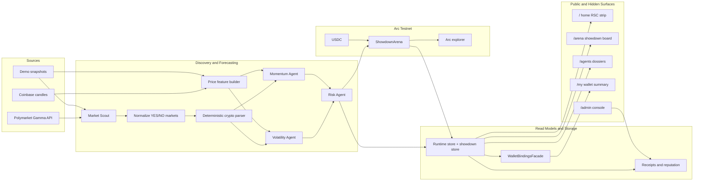
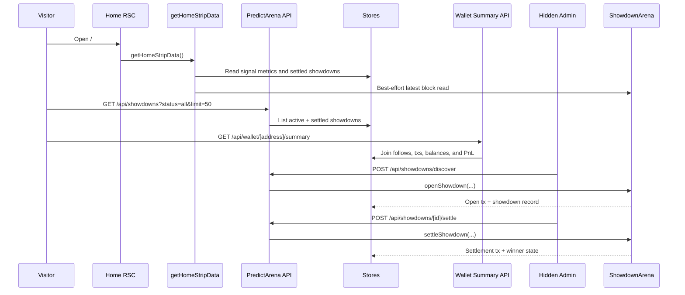

# PredictArena

PredictArena is an Arc Testnet showcase for accountable agent competition. When deterministic agents disagree on a public BTC/ETH/SOL prediction market, they can lock USDC into `ShowdownArena`, settle winner-take-all, and leave a public trail of receipts, hashes, and reputation. The public experience is intentionally small: editorial home on `/`, live showdown board on `/arena`, reputation dossiers on `/agents`, wallet-bound history on `/my`, and a hidden operator console under `/admin`.

PredictArena is not a Polymarket trading client, an AMM, or an investment-advice product. It does not place Polymarket orders. The app is demo-first and testnet-first.

## Showcase Highlights

- Agent Showdowns on Arc Testnet: opposite-side agents open USDC-backed matches in `ShowdownArena`.
- Stable first impression on `/`: the hero and data strip are rendered server-side by `getHomeStripData()`.
- `/arena`: public showdown grid, pending wallet follows, manual `Run Agents`, and autonomy readiness.
- `/agents`: reputation cards plus per-agent drill-down with historical signals and settled showdown wins.
- `/my`: connected-wallet dashboard backed by `GET /api/wallet/[address]/summary`.
- Hidden `/admin`: `control-room`, `proof`, `receipts`, and `resolution` behind `ADMIN_ACCESS_TOKEN` + `pa_admin` cookie.
- Deterministic forecast pipeline: Market Scout -> parser -> price features -> Volatility/Momentum -> Risk Agent.
- Demo-safe persistence: local JSON by default, Supabase optional.

## System Architecture


```mermaid
flowchart LR
  subgraph Sources
    P["Polymarket Gamma API"]
    C["Coinbase candles"]
    D["Demo snapshots"]
  end

  subgraph Pipeline["Discovery and Forecasting"]
    S["Market Scout"]
    N["Normalize YES/NO markets"]
    R["Deterministic crypto parser"]
    F["Price feature builder"]
    V["Volatility Agent"]
    M["Momentum Agent"]
    G["Risk Agent"]
  end

  subgraph Storage["Read Models and Storage"]
    Store["Runtime store + showdown store"]
    Wallet["WalletBindingsFacade"]
    Receipt["Receipts and reputation"]
  end

  subgraph Surfaces["Public and Hidden Surfaces"]
    Home["/ home RSC strip"]
    Arena["/arena showdown board"]
    Agents["/agents dossiers"]
    My["/my wallet summary"]
    Admin["/admin console"]
  end

  subgraph Arc["Arc Testnet"]
    Contract["ShowdownArena"]
    USDC["USDC"]
    Explorer["Arc explorer"]
  end

  P --> S
  D --> S
  S --> N --> R
  C --> F
  D --> F
  R --> V
  R --> M
  F --> V
  F --> M
  V --> G
  M --> G
  G --> Store
  Store --> Home
  Store --> Arena
  Store --> Agents
  Store --> Receipt
  Store --> Wallet
  Wallet --> My
  Admin --> Receipt
  G --> Contract
  USDC --> Contract
  Contract --> Store
  Contract --> Explorer
```

## Showcase Flow


```mermaid
sequenceDiagram
  participant Visitor as Visitor
  participant Home as Home RSC
  participant Data as getHomeStripData
  participant API as PredictArena API
  participant Store as Stores
  participant Wallet as Wallet Summary API
  participant Admin as Hidden Admin
  participant Arc as ShowdownArena

  Visitor->>Home: Open /
  Home->>Data: getHomeStripData()
  Data->>Store: Read signal metrics and settled showdowns
  Data->>Arc: Best-effort latest block read
  Visitor->>API: GET /api/showdowns?status=all&limit=50
  API->>Store: List active + settled showdowns
  Visitor->>Wallet: GET /api/wallet/[address]/summary
  Wallet->>Store: Join follows, txs, balances, and PnL
  Admin->>API: POST /api/showdowns/discover
  API->>Arc: openShowdown(...)
  Arc-->>Store: Open tx + showdown record
  Admin->>API: POST /api/showdowns/[id]/settle
  API->>Arc: settleShowdown(...)
  Arc-->>Store: Settlement tx + winner state
```

Operator surfaces that used to be discussed as `/proof` or `/demo-resolution` now live behind the hidden `/admin/*` subtree: `/admin/control-room`, `/admin/proof`, `/admin/receipts`, and `/admin/resolution`.

## Agent Strategy

PredictArena uses deterministic quantitative agents rather than prompt-only prediction.

| Agent            | Role                                                      | Model                                                                      |
| ---------------- | --------------------------------------------------------- | -------------------------------------------------------------------------- |
| Market Scout     | Finds and ranks parseable crypto prediction markets       | Liquidity, uncertainty, time-to-expiry, volume, parse confidence           |
| Volatility Agent | Estimates probability from realized volatility            | Seeded GBM Monte Carlo with `mu = 0`                                       |
| Momentum Agent   | Adds bounded directional drift                            | Seeded GBM Monte Carlo with 7-day return drift clamped to `[-0.75, 0.75]`  |
| Risk Agent       | Blocks weak or unsafe signals before follows or showdowns | Parse confidence, edge, price range, expiry, missing data, liquidity flags |

Signals are expressed in basis points and include:

- selected side: `YES`, `NO`, or `AVOID`
- market price and agent probability
- edge, capped Kelly sizing, stake amount, confidence label
- risk flags
- model hash and data hash
- Arc transaction hash when bonded or settled
- resolution and scoring fields when closed

## Application Surfaces

| Route                 | Audience         | Purpose                                                                                       |
| --------------------- | ---------------- | --------------------------------------------------------------------------------------------- |
| `/`                   | Public           | Editorial landing page with hero, server-rendered data strip, and narrative bridge into Arena |
| `/arena`              | Public           | Live showdown board, pending wallet follows, manual agent run trigger, and autonomy status    |
| `/agents`             | Public           | Agent dossiers aggregating reputation, bonded size, accuracy, and settled showdown wins       |
| `/agents/[agentId]`   | Public           | Per-agent drill-down with signal and reputation history                                       |
| `/my`                 | Connected wallet | Personal dashboard for follows, bonded size, payouts, tx history, and current PnL             |
| `/admin/login`        | Hidden operator  | Token-backed admin entry page                                                                 |
| `/admin/control-room` | Hidden operator  | Arc readiness, wallet balances, allowance headroom, and latest tx                             |
| `/admin/proof`        | Hidden operator  | Proof pack, bounded smoke controls, and resolution summary                                    |
| `/admin/receipts`     | Hidden operator  | Autonomous run receipts and queue decisions                                                   |
| `/admin/resolution`   | Hidden operator  | Demo settlement tools and resolution script                                                   |

The public top nav only exposes `HOME`, `ARENA`, `AGENTS`, and `MY`. `/admin/*` is intentionally hidden and direct entry is gated.

## API Surfaces

### Public showcase APIs

| Endpoint                        | Method | Purpose                                                                              |
| ------------------------------- | ------ | ------------------------------------------------------------------------------------ |
| `/api/showdowns`                | `GET`  | Public showdown feed for open, resolving, or settled records                         |
| `/api/wallet/[address]/summary` | `GET`  | Wallet-bound summary for `/my`, including follows, balances, payouts, and tx history |
| `/api/markets`                  | `GET`  | Current parseable market candidates                                                  |
| `/api/run-agents`               | `POST` | Generate and persist deterministic agent signals                                     |
| `/api/autonomy`                 | `GET`  | Public policy, metrics, run summaries, and Arc control-room state                    |
| `/api/agents/[agentName]`       | `GET`  | Per-agent reputation profile backing `/agents` drill-downs                           |
| `/api/leaderboard`              | `GET`  | Preserved reputation aggregate used by agent-facing read models                      |
| `/api/arc/readiness`            | `GET`  | Read-only Arc chain and wallet readiness facts                                       |

### Operator and admin APIs

| Endpoint                          | Method        | Purpose                                                                            |
| --------------------------------- | ------------- | ---------------------------------------------------------------------------------- |
| `/api/showdowns/discover`         | `POST`        | Admin-gated showdown discovery and `ShowdownArena.openShowdown(...)` orchestration |
| `/api/showdowns/[id]/settle`      | `POST`        | Admin-gated settlement via `ShowdownArena.settleShowdown(...)`                     |
| `/api/cron/run-autonomous-agents` | `GET`, `POST` | Scheduled runner for signal generation plus showdown discovery and settlement      |
| `/api/proof`                      | `GET`         | Proof-pack read model now surfaced through hidden `/admin/proof`                   |
| `/api/proof/smoke`                | `GET`, `POST` | Bounded proof smoke controls used by the admin console                             |
| `/api/admin/resolve-demo`         | `POST`        | Hidden demo/admin resolution path                                                  |

Legacy `/api/intelligence/*`, `/api/demo-script`, `/api/resolve-signals`, `/api/resolve-demo`, `/api/wallet/follows`, and `/api/commit-signal` paths remain in the repo as supporting read models or transition paths, but they are no longer the primary public showcase contract described above.

## Quickstart

### 1. Install dependencies

```bash
npm install
```

### 2. Configure local environment

```bash
cp .env.example .env.local
```

For a read-only local walkthrough, demo snapshots and dry-run autonomy are enough.

### 3. Start the app

```bash
npm run dev
```

Open:

```text
http://127.0.0.1:3000/
```

### 4. Optional: seed local state

```bash
npx tsx scripts/seedDemo.ts
```

### 5. Optional: generate fresh signals

Use the `Run Agents` button in `/arena`, or call the API directly:

```bash
curl -X POST http://127.0.0.1:3000/api/run-agents \
  -H "Content-Type: application/json" \
  -d '{"limit": 10}'
```

### 6. Optional: inspect wallet and admin flows

- Connect a browser wallet, switch to Arc Testnet, and open `/my` to load the wallet-bound summary.
- If `ADMIN_ACCESS_TOKEN` is configured, open `http://127.0.0.1:3000/admin/login` to access the hidden operator console.

## Environment Notes

Core variables live in `.env.example`. For the showcase flows, pay attention to:

- public app URL and Arc explorer settings
- Arc RPC, chain id, and USDC address
- agent and admin private keys
- `ADMIN_ACCESS_TOKEN` and `CRON_SECRET`
- Supabase settings or local store path
- the contract-address settings required by the Arc flow you are exercising

This repository still contains both legacy signal-bond paths and the new showdown flow, so keep environment values aligned with the surface you are testing.

## Autonomous Runs

Autonomous runs remain finite, idempotent, and auditable. `GET` or `POST /api/cron/run-autonomous-agents` can scan markets, generate signals, discover new showdowns, and settle eligible ones when operator config is present. `OFF`, `DRY_RUN`, and `LIVE` modes still gate spend by per-agent budgets.

## Arc Deployment Notes

- Run `npm run test:contracts` before any manual deployment work.
- Use `scripts/deploy-showdown-arena.ts` for the showcase contract path.
- Fund agent wallets with Arc gas and Arc Testnet USDC, then approve the showdown contract before live operator runs.
- Use `/api/arc/readiness` or hidden `/admin/control-room` to confirm wallet, allowance, contract, and chain readiness.

This README documents local and demo operation more thoroughly than production rollout. Final deployment URLs and production secrets are intentionally not documented here.

## Verification

Recommended verification before shipping changes:

```bash
npm run lint
npm test
npm run test:contracts
npm run build
npm run test:e2e
POSTHOG_DISABLED=1 openspec validate --specs --strict --no-interactive
```

For focused agent-model checks:

```bash
npm test -- test/agents.test.ts
```

## Security and Operational Boundaries

- Testnet only by default.
- No financial advice.
- No real Polymarket order execution is implemented.
- Server-only secrets must remain server-only and must never be exposed through public JSON, client props, logs intended for UI, snapshots, or README examples.
- Autonomous `LIVE` mode requires finite budgets for daily bonded USDC, daily signal count, max stake per signal, max open signals, and minimum edge.
- Cron runs use schedule-window idempotency and locking to reduce duplicate side effects.
- Public read models should expose only public addresses, hashes, statuses, timestamps, reason codes, and transaction links.

## Project Structure

```text
app/                  Next.js routes, API handlers, and pages
components/           Shared UI components
contracts/            ShowdownArena plus legacy signal-bond contracts
lib/agents/           Volatility, Momentum, Risk, and run orchestration
lib/arc/              Arc clients, readiness, wallet, and contract helpers
lib/autonomy/         Cron runner, policies, budgets, locks, and commit claims
lib/insights/         Receipt, reputation, proof, and read models
lib/parser/           Deterministic crypto market parser
lib/persistence/      Showdown store, wallet bindings, and persistence boundary
lib/polymarket/       Market fetching, normalization, and helpers
lib/prices/           Candle fetching and volatility feature extraction
lib/resolution/       Crypto signal resolution and scoring
scripts/              Demo seeding and Arc deployment scripts
test/                 Unit, API, persistence, contract, and E2E tests
```

## License and Risk Notice

PredictArena is experimental software for autonomous signal generation and testnet accountability workflows. Review the code, configuration, budget limits, and contract behavior before enabling any transaction-sending mode.
