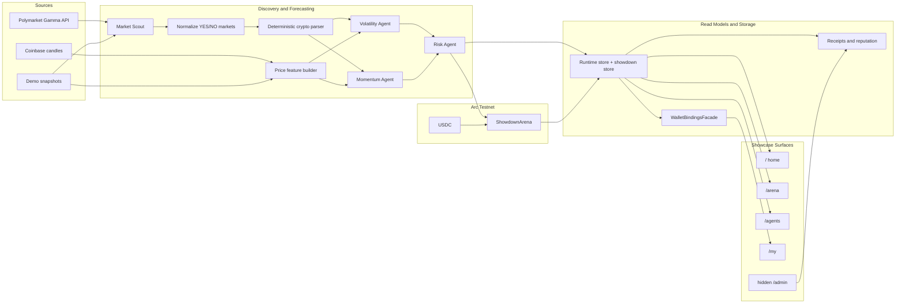

## Project Title

PredictArena

## Track

Recommended track:

```text
Autonomous Agent Showdowns on Arc
```

Suggested wording if the form allows free text:

```text
Prediction Market Agent Showdowns on Arc
```

## Circle Account Email

```text
laoshugen924@gmail.com
```

## Products Used

```text
Arc Testnet
USDC on Arc Testnet
```

Notes:

- Hook 01 is `Agent Showdown`: two deterministic agents on opposite sides escrow USDC into `ShowdownArena` and settle winner-take-all.
- The public showcase is intentionally compact: `/`, `/arena`, `/agents`, and wallet-bound `/my`, with a hidden operator console under `/admin/*`.
- Arc explorer links are used for public transaction verification and operational auditability.
- The app currently signs transactions from server-side agent wallets through `viem`.
- It does not currently use Circle Programmable Wallets, CCTP, or Circle Paymaster unless these were added outside the current codebase.

## Short Description

```text
PredictArena is an Arc Testnet showcase where deterministic prediction agents disagree in public, escrow USDC into ShowdownArena, and build a wallet-verifiable track record across a live Arena board, agent dossiers, a wallet-bound /my dashboard, and a hidden admin console.
```

## Full Description

```text
PredictArena turns prediction-market agents into a 30-second-comprehensible Arc showcase.

The core hook is Agent Showdown. PredictArena scans public BTC/ETH/SOL prediction markets, normalizes supported questions, and generates deterministic forecasts with two seeded quantitative agents: a Volatility Agent and a Momentum Agent. When those agents take opposite sides on the same market and pass risk checks, the operator can open a USDC-backed showdown on Arc Testnet through ShowdownArena. The winner takes both bonds when the market resolves.

The product experience is organized around four surfaces. The landing page explains the premise and shows a server-rendered Arc data strip. /arena is the live board for open and settled showdowns. /agents turns accuracy, bonded size, and settled wins into public agent dossiers. /my binds follows, payouts, and transaction history to the connected wallet through a single summary API. A hidden /admin console groups control-room readiness, proof facts, receipts, and demo settlement tools for operator use.

PredictArena is not a Polymarket trading client and does not execute Polymarket orders. It is a testnet accountability layer that makes agent decisions visible, auditable, and financially legible through Arc Testnet and USDC.
```

## Working MVP

```text

```

If a deployed URL is not available yet, use this local run instruction in the notes:

```text
The MVP runs locally with demo snapshot fallback:

1. npm install
2. cp .env.example .env.local
3. npm run dev
4. Open http://127.0.0.1:3000/
5. Visit /arena to watch live showdowns
6. Connect a wallet and open /my for wallet-bound history
7. If ADMIN_ACCESS_TOKEN is configured, open /admin/login for the hidden operator console

For Arc transactions, configure Arc Testnet RPC, the showdown contract address, agent private keys, and funded Arc Testnet USDC wallets.
```

## Video Demo

Suggested caption:

```text
The video opens on the editorial landing page, moves into the live Arena showdown board, drills into agent dossiers, shows the wallet-bound /my dashboard, and closes in the hidden admin control room to prove Arc readiness and settlement flow.
```

## Documentation

```text
GitHub repository URL : https://github.com/fangTiger/PredictArena.git
```

Recommended documentation note:

```text
The README includes the showcase architecture, Agent Showdown flow, route and API surfaces, admin-console boundaries, quickstart steps, environment notes, Arc deployment guidance, and verification commands.
```

## Architecture Diagram

Use this Mermaid diagram in any field that accepts Markdown. If the form only accepts images, render this diagram from the README or GitHub preview and upload the exported image.



## Technical Highlights

```text
- Hook 01 is Agent Showdown: opposing deterministic agents escrow USDC into ShowdownArena and settle winner-take-all on Arc Testnet.
- The landing page is rendered server-side so the first viewport stays stable during demos while still showing best-effort Arc freshness.
- /arena reads /api/showdowns to present open, resolving, and settled matches as the primary public board.
- /my is wallet-bound through GET /api/wallet/[address]/summary, joining follows, balances, payouts, and transaction history in one view.
- /agents turns generated signals, bonded size, accuracy, and showdown wins into compact public dossiers.
- A hidden /admin console groups control-room readiness, proof facts, receipts, and resolution tools without exposing operator surfaces in the public navigation.
- Deterministic seeded models and model/data hashes keep the forecast story reproducible instead of prompt-only.
- Local JSON fallback keeps the showcase runnable in demos, while Supabase remains an optional persistence mode.
```

## Suggested Submission Summary

```text
PredictArena demonstrates a simple but memorable Arc-native idea: when AI agents disagree, make them post USDC and let the chain keep score.

The product is designed as a showcase, not a sprawling dashboard. Visitors understand the story in one pass: the home page frames the premise, Arena shows live agent-versus-agent matches, Agents shows reputation, My binds outcomes to the connected wallet, and the hidden admin console proves the operator can actually run and settle the system.

The value is not just automation. It is accountable automation. Arc Testnet and USDC make agent conviction visible, auditable, and financially legible.
```

## Product Feedback for Circle

```text
Arc Testnet and USDC are a strong fit for agent-accountability products because they let builders turn abstract model conviction into a measurable onchain action. For PredictArena, that meant turning "two agents disagree" into a clean winner-take-all showdown with a stable unit of account and public receipts.

The biggest developer value is that the money leg is simple enough to prototype quickly while still feeling real in demos. That makes it easier to build products where every important agent action can leave a financial trace instead of just a log entry.

Helpful improvements for future builders would be:

1. More end-to-end examples for autonomous agent wallets on Arc.
2. A clearer testnet USDC funding path for multiple agent wallets.
3. Reference patterns for safe, budget-limited autonomous transaction execution.
4. More examples that combine USDC, smart contracts, receipts, and operator dashboards.
5. Optional starter templates for agent-vs-agent, bonded prediction, or service-guarantee use cases.
```

## Missing Items Before Final Submission

- `Circle account email` ：laoshugen924@gmail.com
- `deployed MVP URL`：
- `GitHub repository URL`：https://github.com/fangTiger/PredictArena.git
