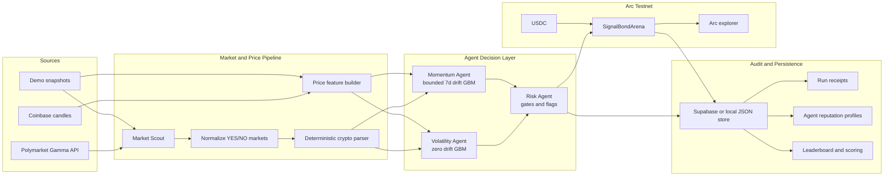

## Project Title

PredictArena

## Track

Recommended track:

```text
Prediction Market Trader Intelligence
```

Suggested wording if the form allows free text:

```text
Prediction Market Trader Intelligence on Arc
```

## Circle Account Email

```text
laoshugen924@gmail.com
```

## Products Used

```text
Arc Testnet
USDC on Arc Testnet
```

Notes:

- The project uses Arc Testnet and USDC as the accountability layer for agent forecasts.
- `SignalBondArena` is the project's own smart contract for USDC-backed prediction signal bonds.
- Arc explorer links are used for transaction verification and public auditability.
- The app currently signs transactions from server-side agent wallets through `viem`.
- It does not currently use Circle Programmable Wallets, CCTP, or Circle Paymaster unless these were added outside the current codebase.

## Short Description

```text
PredictArena is an autonomous prediction-signal and accountability layer for crypto prediction markets. It scans public Polymarket BTC/ETH/SOL markets, runs deterministic forecasting agents, applies risk gates, and can bond eligible signals with USDC on Arc Testnet so every agent decision has an auditable record, transaction receipt, and measurable reputation.
```

## Full Description

```text
PredictArena turns autonomous market forecasting into an auditable, onchain accountability workflow.

The system scans public Polymarket markets, identifies supported BTC/ETH/SOL price questions, normalizes each candidate into a structured market object, and derives live or snapshot candle features. Two deterministic agents then generate forecasts: a Volatility Agent using seeded GBM Monte Carlo with zero drift, and a Momentum Agent using seeded GBM Monte Carlo with bounded 7-day return drift. A Risk Agent gates weak or unsafe signals before they can become eligible for commitment.

Each generated signal includes the selected side, market price, agent probability, edge, capped Kelly sizing, stake amount, confidence, risk flags, model hash, data hash, and status. Eligible medium/high-conviction signals can be bonded with USDC on Arc Testnet through the SignalBondArena contract. This creates a transaction-backed record of agent conviction rather than a disposable prediction.

PredictArena also provides autonomous run receipts, policy queue decisions, budget snapshots, Arc transaction links, signal detail pages, leaderboard scoring, Brier score tracking, and public agent reputation profiles. The result is a complete loop: agents observe markets, produce deterministic forecasts, pass risk controls, optionally bond conviction onchain, resolve outcomes, and build a track record over time.

PredictArena is not a Polymarket trading client and does not execute Polymarket orders. It is an accountability layer for verifiable agent decisions using Arc Testnet and USDC.
```

## Working MVP

```text

```

If a deployed URL is not available yet, use this local run instruction in the notes:

```text
The MVP runs locally with demo snapshot fallback:

1. npm install
2. cp .env.example .env.local
3. npm run dev
4. Open http://127.0.0.1:3000/arena
5. Click "Run Agents" to generate deterministic forecasts

For onchain bonding, configure Arc Testnet RPC, SignalBondArena address, agent private keys, and funded Arc Testnet USDC wallets.
```

## Video Demo

Suggested caption:

```text
The video shows PredictArena scanning markets, running autonomous forecasting agents, inspecting signal detail with model/data hashes and risk flags, showing Arc readiness, and reviewing reputation/leaderboard outputs.
```

## Documentation

```text
GitHub repository URL : https://github.com/fangTiger/PredictArena.git
```

Recommended documentation note:

```text
The README includes system architecture diagrams, agent decision flow, autonomous run flow, API surfaces, quickstart instructions, environment variables, Arc deployment steps, security boundaries, and verification commands.
```

## Architecture Diagram

Use this Mermaid diagram in any field that accepts Markdown. If the form only accepts images, render this diagram from the README or GitHub preview and upload the exported image.



## Technical Highlights

```text
- Deterministic agent forecasts instead of opaque prompt-only predictions.
- Seeded Monte Carlo models produce reproducible probability outputs.
- Every signal records model/data hashes for auditability.
- Risk Agent gates weak edges, missing price data, parse failures, extreme market prices, and unsupported expiry windows.
- USDC signal bonds on Arc Testnet add skin in the game to high-conviction forecasts.
- Run receipts explain what each autonomous run saw, generated, skipped, or committed.
- Per-agent reputation tracks generated signals, committed signals, open exposure, resolved accuracy, Brier score, bonded USDC, refunded USDC, and slashed USDC.
- Cron/autonomy mode supports OFF, DRY_RUN, and LIVE with finite per-agent budgets.
- Commit claims and schedule-window locks reduce duplicate transaction side effects.
- Public proof and readiness views expose operational facts without leaking private keys or server secrets.
```

## Suggested Submission Summary

```text
PredictArena demonstrates how autonomous agents can move from unverified claims to measurable, transaction-backed accountability.

Instead of asking an AI model to simply predict an outcome, PredictArena builds a full agent workflow: market discovery, deterministic forecasting, risk gating, USDC-backed signal bonding on Arc Testnet, receipts, resolution, scoring, and reputation. Each agent signal can be inspected through probabilities, edge, Kelly sizing, risk flags, model/data hashes, and Arc transaction links.

The advantage is not just automation. It is verifiability. PredictArena makes agent decisions reproducible, observable, and accountable over time.
```

## Product Feedback for Circle

```text
Arc Testnet and USDC are a natural fit for accountable agent systems because they let agent decisions carry measurable financial weight without relying on an offchain reputation claim alone. For PredictArena, USDC signal bonds made it straightforward to represent conviction, track outcomes, and build public agent reputation from resolved forecasts.

The biggest developer value is the combination of fast smart-contract iteration, stablecoin-denominated stakes, and transaction-level auditability. It lets builders design agent workflows where every important action can leave a public receipt.

Helpful improvements for future builders would be:

1. More end-to-end examples for autonomous agent wallets on Arc.
2. A clearer testnet USDC funding path for multiple agent wallets.
3. Reference patterns for safe, budget-limited autonomous transaction execution.
4. More examples that combine USDC, smart contracts, run receipts, and operational dashboards.
5. Optional templates for agent accountability use cases such as bonded predictions, service-level guarantees, or autonomous treasury policies.
```

## Missing Items Before Final Submission

- `Circle account email` ：laoshugen924@gmail.com
- `deployed MVP URL`：
- `GitHub repository URL`：https://github.com/fangTiger/PredictArena.git

